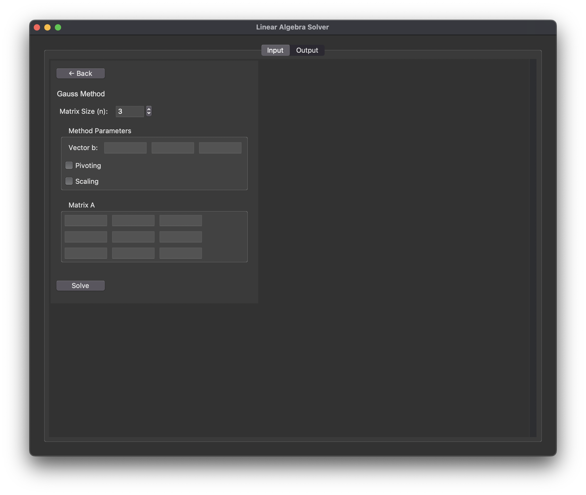

# Linear-algebra

## 📌 Project Overview
This project implements various **numerical methods for solving systems of linear equations**.
It includes:
- **Graphical User Interface (GUI)** for better interaction
- **Direct methods**:
  - Gaussian Elimination
  - LU Decomposition (Matrix Factorization)
- **Iterative methods**:
  - Jacobi Method
  - Gauss-Seidel Method
  - Successive Over-Relaxation (SOR)
- **Residual Correction Technique**

## ▶️ How to Run
1. Install all required libraries:
   ```bash
   pip install -r requirements.txt
   ```
2. Run the main program:
   ```bash
   python main.py
   ```
## 🖼️ Screenshot
Here is a preview of the application:



